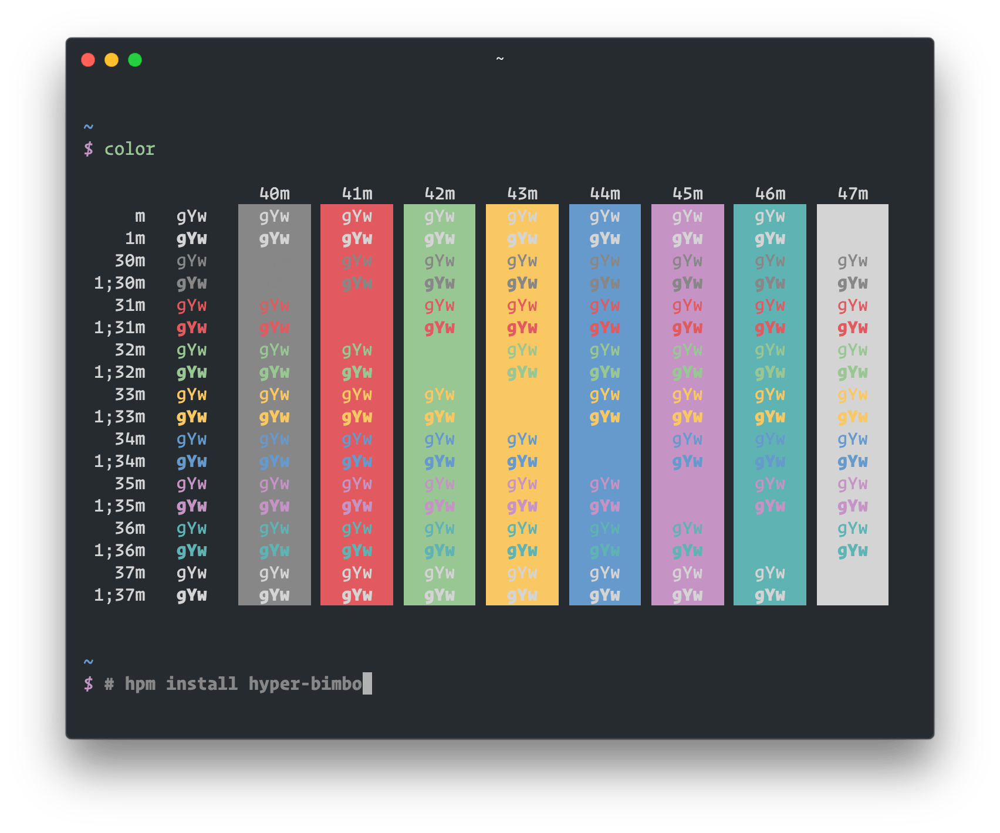

# Hyper Bimbo

A [Hyper](https://hyper.is/) theme based on [Bimbo Theme](https://github.com/pawelgrzybek/bimbo-theme) for [Visual Studio Code](https://code.visualstudio.com/).



## Installation

Using [hpm](https://github.com/zeit/hpm):

```bash
hpm install hyper-bimbo
```

Manually:

```diff
# ~/.hyper.js

module.exports = {
  plugins: [
+   'hyper-bimbo',
  ],
}
```
